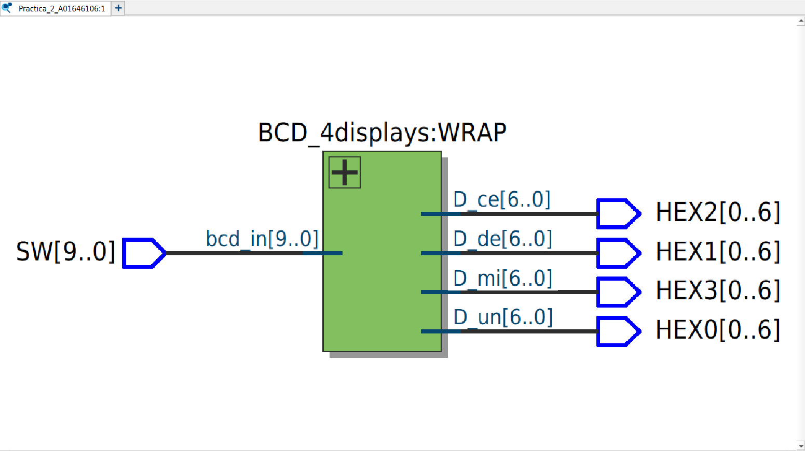
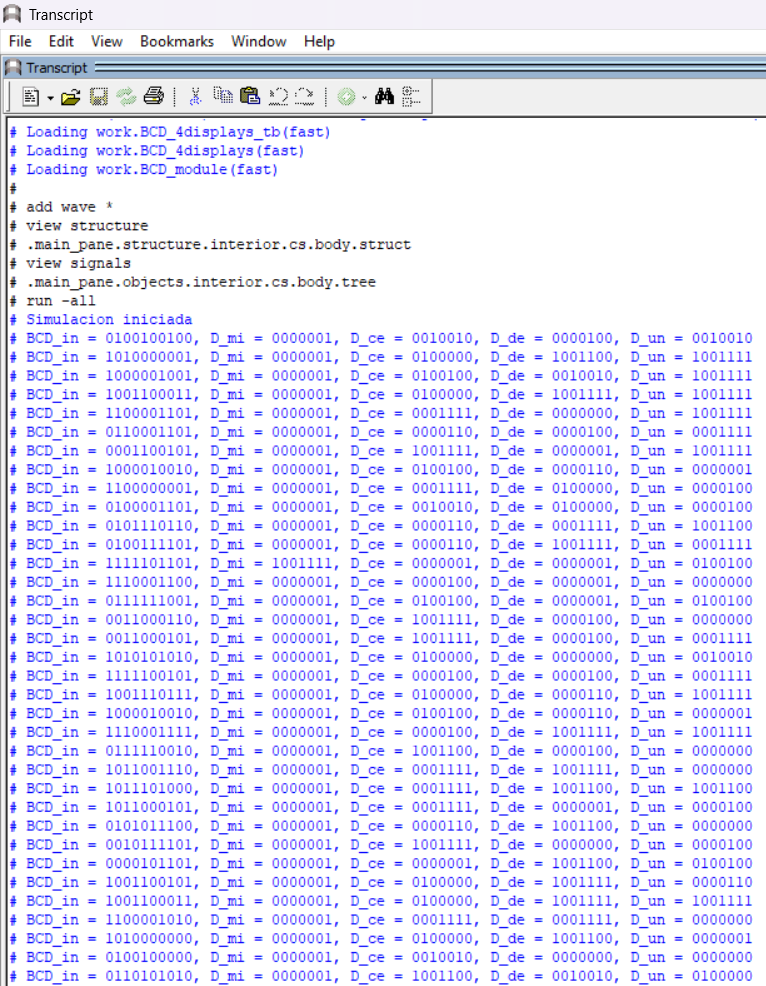
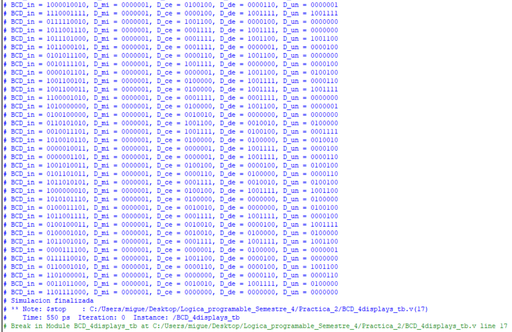
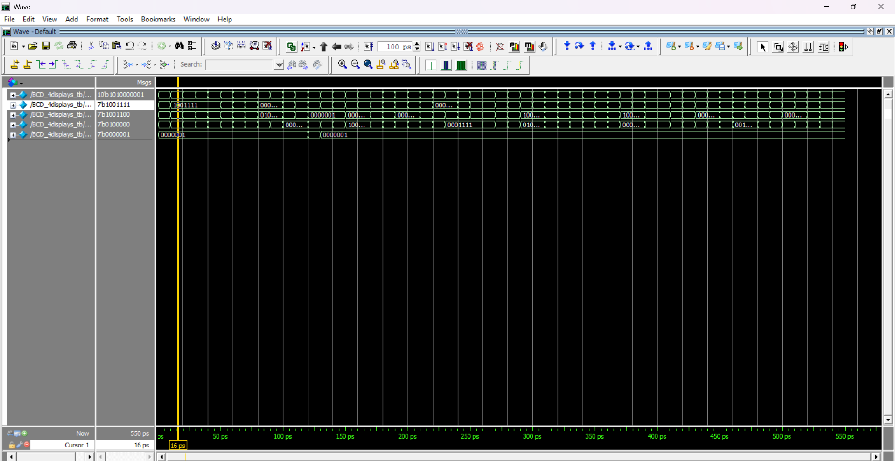

Miguel Alonso De La Rosa Zamora A01646106
# Decodificador BCD
## Objetivo:
  - Implementar un sistema Verilog que lea el valor de 10 switches de la FPGA, interprete su valor como un número binario y lo convierta a un número decimal y lo represente en 4 displays. 
## Materiales Necesarios:
  - Tarjeta FPGA DE10-Lite
  - Cable USB Blaster para la programación
  - Software Intel Quartus Prime Lite
  - Código en Verilog
## Descripción del Funcionamiento:
  - Los 10 switches de la FPGA representan un número en binario.
  - El valor ingresado en los switches se separa por su valor posicional (unidades, decenas, centenas y millares) y con ello se convierte a un número decimal impreso en 4 displays (1 por cada valor posicional del número).
  - Se muestra en el display el número en decimal. 
## Desarrollo de la Práctica:
  1. Definir entradas y salidas:
     - Entradas: 10 switches (SW[9:0])
     - Salidas: 4 displays (HEX0[6:0]), (HEX1[6:0]), (HEX2[6:0]), (HEX3[6:0])

Subir el repositorio donde se encuentran los archivos .v de los módulos, su testbench, y las imágenes necesarias para comprobar el óptimo funcionamiento del sistema. 
## Descripción de los módulo:
El módulo *BCD_module* recibe una entrada *bcd_in* de 4 bits que representa un número binario entre 0 y 9, y genera una salida *bcd_out* de 7 bits correspondiente a la codificación del número en un display de 7 segmentos. La salida se obtiene mediante un bloque *case*, asignando el patrón adecuado para cada número decimal. La señal de salida se niega debido a que el display del FPGA utiliza lógica activa en bajo. 

El módulo *BCD_4displays* recibe una entrada binaria *bcd_in* de *N_in* bits que representa un número decimal completo y genera cuatro salidas (*D_un*, *D_de*, *D_ce*, *D_mi*) correspondientes a unidades, decenas, centenas y millares, respectivamente. El número de entrada se separa según su valor posicional utilizando operaciones aritméticas, y cada dígito resultante se convierte a su representación en display de 7 segmentos mediante la instanciación del mósulo *BCD_module*.  
## Testbench:
Se desarrolló un testbench para verificar el funcionamiento del módulo 'BCD_4displays', aplicando posibles casos usando *random*. 
## Diagrama RTL:
El siguiente diagrama muestra la implementación lógica generada por Quartus a partir del código Verilog del módulo. 

## Waveform:
A continuación se observa la simulación temporal del circuito, donde se verifica el comportamiento correcto de la salida para los distintos valores de entrada. 

## Tarjeta DEL10-lite funcionando:
