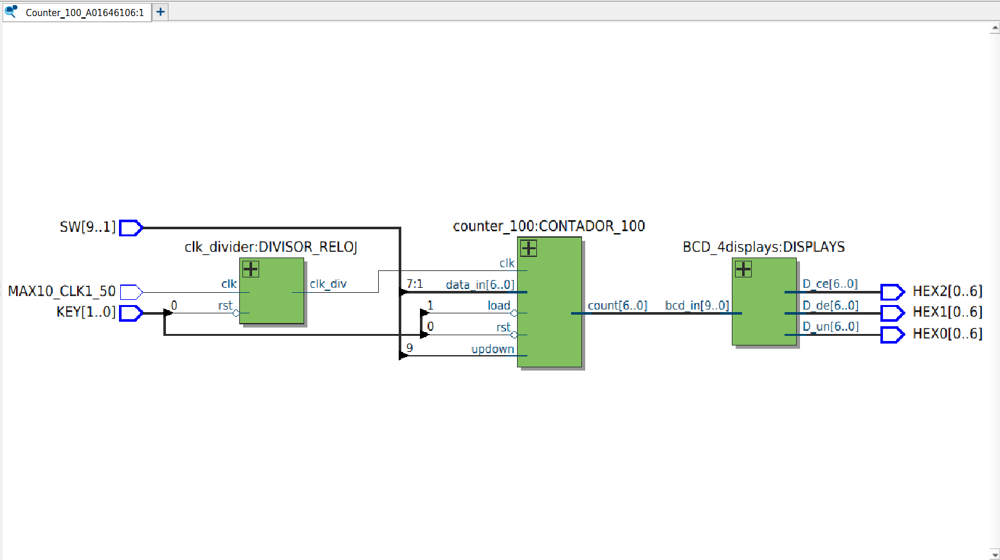
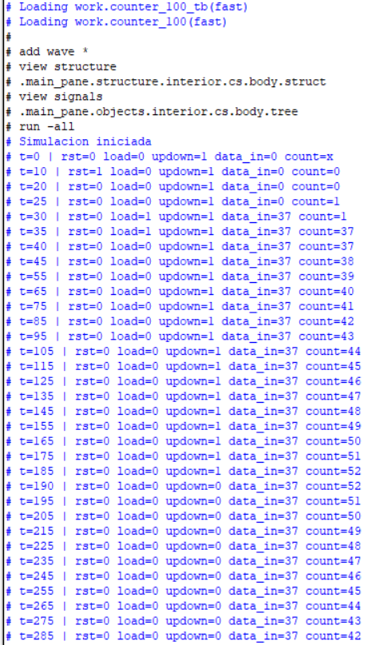
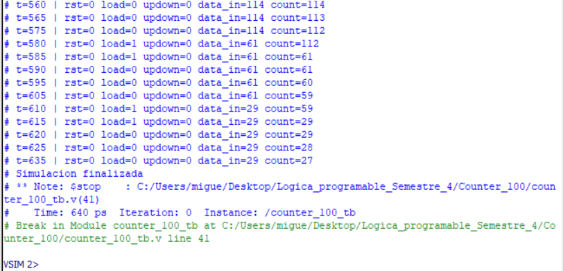
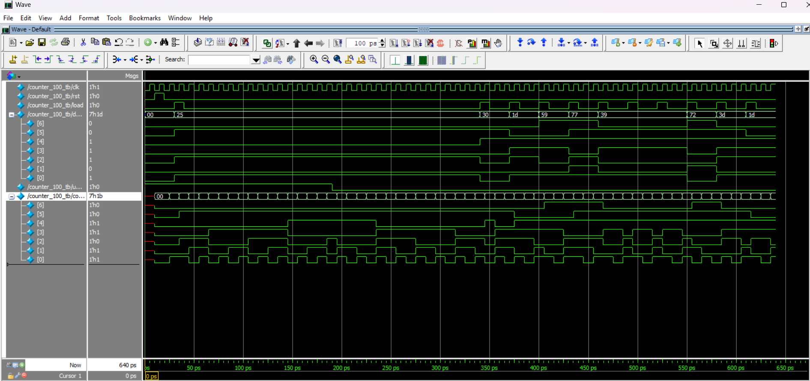

Miguel Alonso De La Rosa Zamora A01646106
# Counter BCD con clock up down
## Objetivo 
  - Implementar un sistema Verilog que funcione como un sistema que sea capaz de contar de manera ascendente o descendente e imprima la cuenta en displays.

 ## Materiales Necesarios:
   - Tarjeta FPGA DE10-Lite
   - Cable USB Blaster para la programación
   - Software Intel Quartus Prime Lite
   - Código en Verilog
## Descripción del Funcionamiento:
  - 1 switch de la FPGA decide si el contador incrementa o decrementa.
  - 1 botón decide si se carga un dato (dato binario definido por switches) a la salida o si sigue el contador.
  - La salida se presenta en 4 displays con los números decimales.
## Desarrollo de la Práctica:
  1. Definir las entradas y salidas:
       - Entradas: 7 switches (SW[6:0]), 1 switch (SW[9:9]), 2 key (KEY[1:0])
       - Reloj: MAX10_CLK1_50
       - Salidas: 3 displays [6:0] (HEX0, HEX1, HEX2)
Subir al repositorio donde se encuentran los archivos .v de los módulos, su testbench, y las imágenes necesarias para comprobar el óptimo funcionamiento del sistema. 

## Descripción de los módulos:

## Testbench:
Se desarrolló un testbench para verificar el funcionamiento del módulo 'counter_100', dejando el contador o cambiando a ascendente o descendente, cargar datos random. 
## Diagrama RTL:
El siguiente diagrama muestra la implementación lógica generada por Quartus a partir del código Verilog del módulo. 

## Waveform:
A continuación se observa la simulación temporal del circuito, donde se verifica el comportamiento correcto con diferentes argumentos de entrada. 

## Tarjeta DE10-lite funcionando:
[Tarjeta DE10-lite counter](https://youtu.be/TP57M3NlJQo)
