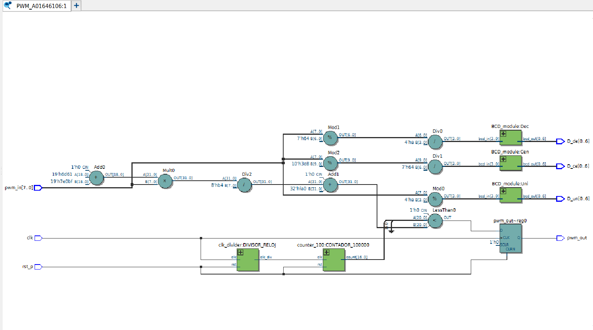
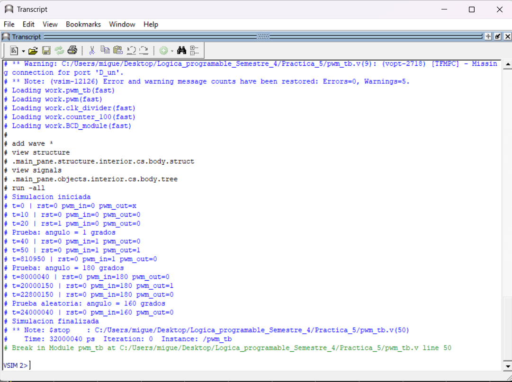
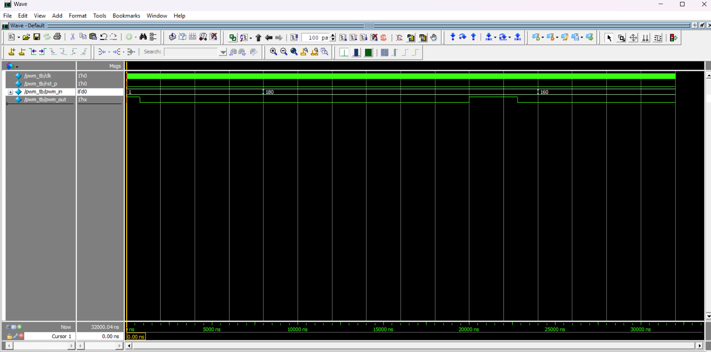

Miguel Alonso De La Rosa Zamora A01646106
# PWM
## Objetivo:
  - Implementar un sistema Verilog que lea el valor de 8 switches de la FPGA, interprete su valor como un número binario (que representa grados de entrada) y de resultado se genera una señal PWM que hace girar el servomotor ciertos grados.

## Materiales Necesarios:
  - Tarjeta FPGA DE10-Lite.
  - Cable USB Blaster para la programación.
  - Software Intel Quartus Prime Lite.
  - Código en Verilog.
  - Jumpers.
  - Servomotor.
## Descripción del Funcionamiento:
  - Los 8 switches de la FPGA representan un número binario.
  - 1 botón de la FPGA para 'reset'.
  - El valor ingresado representan los grados de entrada que queremos que se mueva el servomotor.
  - El display presenta los grados de entrada seleccionados.
  - El servomotor gira los grados que se ingresan a la entrada.

## Desarrollo de la Práctica:
1. Definir las entradas y salidas:
      - Entradas: 8 switches (SW[8:1]), 1 key (KEY[0:0])
      - Reloj: MAX10_CLK1_50
      - Salidas: 3 displays [6:0] (HEX0, HEX1, HEX2) y ARDUINO_IO [9:0] (ARDUINO_IO[0])

Subir al repositorio donde se encuentran los archivos .v de los módulos, su testbench, y las imágenes necesarias para comprobar el óptimo funcionamiento del sistema. 
## Descripción de los módulos:
El módulo BCD_module recibe una entrada bcd_in de 4 bits que representa un número binario entre 0 y 9, y genera una salida bcd_out de 7 bits correspondiente a la codificación del número en un display de 7 segmentos. La salida se obtiene mediante un bloque case, asignando el patrón adecuado para cada número decimal. La señal de salida se niega debido a que el display del FPGA utiliza lógica activa en bajo.

El módulo clk_divider recibe como entrada el reloj interno del FPGA de 50 MHz y una señal de reinicio (rst), y genera una señal de reloj de salida (clk_div) con una frecuencia menor definida por el parámetro FREQ. La frecuencia de salida se obtiene mediante un contador que incrementa su valor en cada flanco positivo del reloj de entrada. Cuando el contador alcanza un valor calculado como constantNumber = CLK_FREQ / (2 * FREQ), este se reinicia y la señal de salida conmuta su estado lógico, logrando así la división de la frecuencia del reloj.

El módulo counter_100 recibe una señal de reloj (clk) y una señal de reinicio (rst), y genera una salida count de 17 bits que representa el valor actual del conteo. El límite máximo del contador está definido por el parámetro CMAX, cuyo valor por defecto es 100,000, calculado a partir de la relación entre la frecuencia interna del FPGA (50 MHz) y la frecuencia deseada de operación (5 MHz). En cada flanco positivo del reloj el contador incrementa su valor en uno, y cuando alcanza o supera el valor de CMAX regresa a cero, generando así un conteo cíclico continuo. Si se activa la señal de reinicio, el contador vuelve a cero de forma inmediata.

El módulo pwm recibe una señal de reloj (clk), una señal de reinicio activa en alto (rst_p) y una entrada de 8 bits (pwm_in) que representa un ángulo entre 0° y 180°, y genera una señal de salida PWM (pwm_out) para controlar la posición de un servomotor. Los parámetros MIN y MAX definen el ciclo de trabajo mínimo y máximo como porcentaje del período, con valores por defecto de 4% y 14% respectivamente. Internamente, un divisor de reloj reduce la frecuencia de 50 MHz a 5 MHz, la cual alimenta al módulo counter_100 que cuenta de forma cíclica hasta 100,000, produciendo una frecuencia de referencia de 50 Hz. El ángulo de entrada se convierte en un valor de comparación mediante interpolación lineal entre los límites mínimo y máximo calculados a partir de los parámetros. En cada flanco positivo del reloj, un comparador evalúa si el conteo actual es menor al valor calculado, manteniendo pwm_out en alto durante ese intervalo y en bajo el resto, generando así el ancho de pulso proporcional al ángulo deseado.

## Testbench
Se desarrolló un testbench para verificar el módulo 'pwm.v', colocando como ángulo de entrada 1°, 180° y un random para observar si se genera la señal PWM de salida. 
## Diagrama RTL
El siguiente diagrama muestra la implementación lógica generada por Quartus a partir del código Verilog del módulo.

## Waveform
A continuación se observa la simulación temporal del circuito, donde se verifica el comportamiento correcto de PWM. 

## Tarjeta DE10-lite funcionando:
