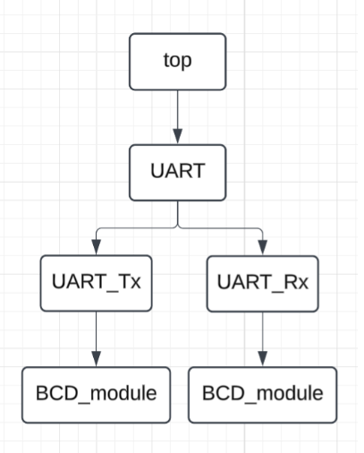

# Práctica 6 - Protocolo de comunicación UART

**Miguel Alonso De La Rosa Zamora** — A01646106  
**Gregorio Alejandro Orozco Torres** — A01641967  
**Sophia Leñero Gómez** — A01639462  

---

# Descripción del proyecto

Para esta práctica, se solicitaba crear por medio de **Verilog HDL** un sistema capaz de generar comunicación entre dos tarjetas **FPGA** utilizando el protocolo **UART (Universal Asynchronous Receiver Transmitter)**.

Este es un protocolo de comunicación serial esencial en el ámbito digital, puesto que es ampliamente utilizado para transmitir datos entre dispositivos sin necesidad de una señal de reloj compartida.

Para la implementación de este proyecto, se implementó un sistema compuesto principalmente por:

- Un **transmisor (UART_Tx)**
- Un **receptor (UART_Rx)**

Ambos se integran por medio de un **wrapper** que permite tanto el envío como la recepción de datos seriales utilizando:

- **Reloj:** 50 MHz  
- **Velocidad de transmisión:** 9600 baudios  

A continuación se relata su proceso de realización.

---

# Arquitectura del sistema

El diseño de este sistema sigue una **arquitectura jerárquica**, en donde la integración general del sistema la realiza el módulo **`top.v`**.

La estructura del sistema es la siguiente:

- **top.v**
  - **UART Wrapper**
    - **UART_Tx** (Transmisor)
    - **UART_Rx** (Receptor)
  - **BCD_module** (Conversión para display)

El módulo **Wrapper** integra los módulos de transmisión y recepción UART.

Finalmente, se utiliza un módulo **BCD_module** para reflejar los datos transmitidos en el **display de 7 segmentos** de la tarjeta.

La arquitectura se muestra en el siguiente diagrama:

---

# Funcionamiento del sistema

El funcionamiento del sistema consiste en lo siguiente:

1. Se introduce en cualquiera de las dos tarjetas un dato en **`data_in`**, el cual se mostrará en los displays.
2. Se activa la señal **`start`**.
3. El módulo **UART_Tx** transmite el dato de manera **serial**.
4. El módulo **UART_Rx** recibe el dato y lo **reconstruye**.
5. Cuando el dato está disponible, se activa **`data_ready`**.
6. El dato recibido se envía al módulo **BCD_module** para mostrar el valor en los **displays de la tarjeta receptora**.

---

# Entradas y salidas

## Entradas

El módulo UART recibe como entradas:

- **`clk`** — Señal de reloj de **50 MHz**
- **`rst`** — Señal de reinicio del sistema
- **`data_in`** — Dato de **8 bits** que se desea transmitir
- **`start`** — Señal que indica cuándo iniciar la transmisión

## Salidas

Las salidas del sistema son:

- **`busy`** — Indica cuando el transmisor está ocupado transmitiendo
- **`data_out`** — Dato recibido de **8 bits**
- **`data_ready`** — Indica que el receptor terminó de recibir el dato

---

# Testbench

Para probar el sistema y verificar su correcto funcionamiento, se realizó un **testbench (`UART_tb`)** que simula el comportamiento del módulo UART y permite observar el intercambio de datos.

El testbench realiza las siguientes acciones:

1. Genera una señal periódica de **50 MHz** (reloj).
2. Inicializa las señales en **0**.
3. Activa la señal **reset** para inicializar el sistema.
4. Espera a que el sistema se estabilice.
5. Genera **10 datos aleatorios** para probar la transmisión.
6. Activa la señal **start** para comenzar a transmitir.
7. Espera a que **`data_ready`** indique la recepción correcta.
8. Muestra en consola el **dato transmitido y el dato recibido**.

---

# Evidencias de la práctica

El contenido multimedia evidenciando la implementación física de la práctica se encuentra en el siguiente enlace:

https://drive.google.com/drive/folders/16P0-7iwm08brlSdnRSv-dWuADJgj4b0D?usp=drive_link

---

# Aprendizajes y conclusiones

En esta práctica se adquirieron diversos aprendizajes relacionados con el **diseño de sistemas digitales** y la **comunicación serial**.

Se comprendió con mayor profundidad el funcionamiento del **protocolo UART**, y el desarrollo del proyecto ayudó a reforzar los conceptos vistos en clase.

Como conclusión, en este proyecto se desarrolló exitosamente un **sistema de comunicación UART** capaz de:

- Transmitir datos en **formato serial**
- Reconstruir correctamente los datos en el **receptor**

Las pruebas realizadas tanto en **simulación (testbench)** como en **implementación física** demostraron que los **datos transmitidos coinciden con los datos recibidos**, validando así el correcto funcionamiento del sistema.

Esta práctica resultó muy valiosa ya que, como ingenieros, es fundamental comprender de manera clara y precisa los **conceptos fundamentales del diseño digital**, como lo es la **comunicación serial**.
