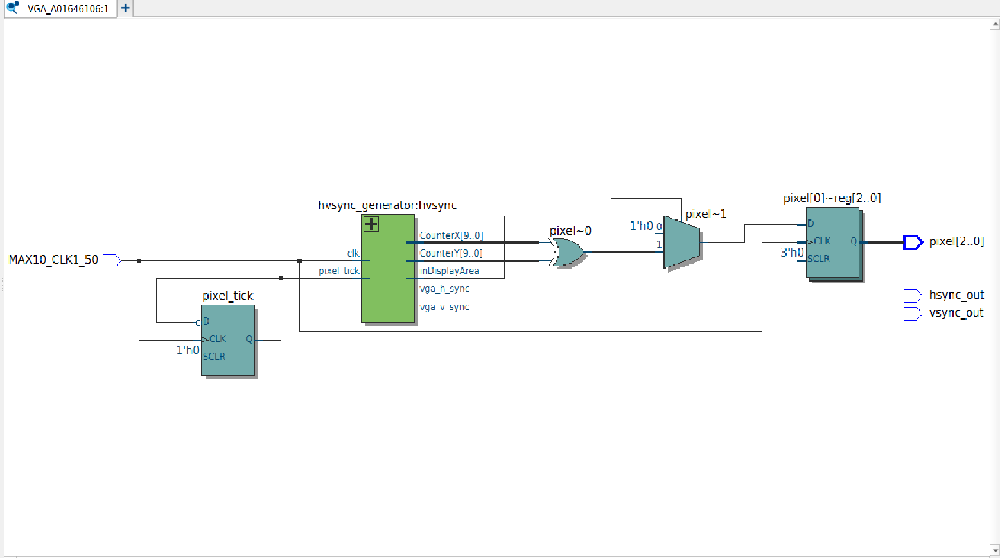
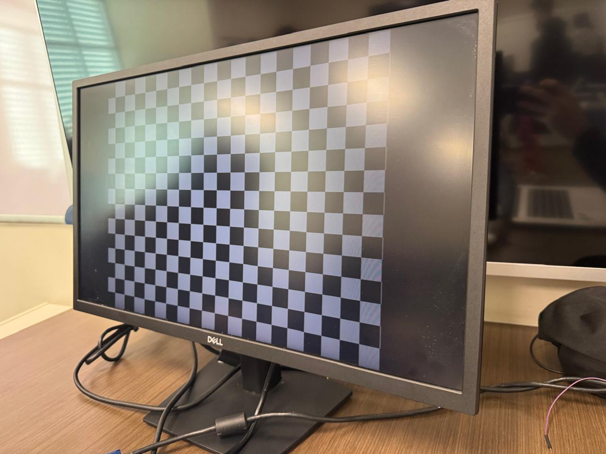

Miguel Alonso De La Rosa Zamora A01646106
# VGA
## Objetivo:
  - Implementar un sistema en Verilog que genere una señal VGA y muestre en pantalla un patrón de tablero de ajedrez, utilizando la lógica de sincronización horizontal y vertical para producir una imagen estable a resolución 640x480 a 60 Hz.

## Materiales Necesarios:
  - Tarjeta FPGA DE10-Lite.
  - Cable USB Blaster para la programación.
  - Software Intel Quartus Prime Lite.
  - Código en Verilog.
  - Monitor con entrada VGA.
  - Cable VGA.

## Descripción del Funcionamiento:
  - El reloj interno de 50 MHz se divide a 25 MHz mediante un registro de alternancia para generar el pixel clock requerido por el estándar VGA.
  - Un generador de sincronización produce las señales hsync y vsync, así como los contadores de posición horizontal (CounterX) y vertical (CounterY).
  - Con base en la posición del píxel actual, se determina si pertenece a una casilla blanca o negra del tablero mediante una operación XOR sobre los bits 5 de cada contador.
  - La señal de salida de color (pixel) toma el valor blanco (3'b111) o negro (3'b000) según corresponda, únicamente dentro del área de visualización activa.

## Desarrollo de la Práctica:
1. Definir las entradas y salidas:
      - Entradas: MAX10_CLK1_50
      - Salidas: pixel [2:0], hsync_out, vsync_out

Subir al repositorio los archivos .v de los módulos y las imágenes necesarias para comprobar el óptimo funcionamiento del sistema.

## Descripción de los módulos:
El módulo hvsync_generator recibe una señal de reloj (clk) y una señal de habilitación de píxel (pixel_tick), y genera las señales de sincronización horizontal (vga_h_sync) y vertical (vga_v_sync), los contadores de posición CounterX y CounterY de 10 bits, y la señal inDisplayArea que indica si el píxel actual se encuentra dentro del área visible. El contador horizontal incrementa en cada ciclo de pixel_tick y se reinicia al alcanzar 799, mientras que el contador vertical incrementa cada vez que CounterX se reinicia y se reinicia al llegar a 524, generando así una resolución de 640x480 píxeles a 60 Hz. Los pulsos de sincronización se generan en las regiones de blanking definidas por el estándar VGA, y las señales de salida se niegan debido a que el estándar VGA utiliza lógica activa en bajo.

El módulo VGADemo recibe el reloj interno del FPGA de 50 MHz y genera las señales de sincronización VGA (hsync_out, vsync_out) y el color del píxel actual (pixel) de 3 bits. Internamente se genera un pixel_tick que alterna cada ciclo del reloj principal, produciendo una frecuencia efectiva de 25 MHz requerida por el estándar VGA a 640x480 a 60 Hz. El módulo instancia hvsync_generator para obtener las señales de sincronización y la posición actual del píxel. El patrón de tablero de ajedrez se genera evaluando la operación XOR entre el bit 5 del contador horizontal y el bit 5 del contador vertical: cuando el resultado es 1 se asigna blanco (3'b111) y cuando es 0 se asigna negro (3'b000), produciendo casillas de 32x32 píxeles. Fuera del área de visualización activa, la salida de color se fuerza a negro.

## Diagrama RTL
El siguiente diagrama muestra la implementación lógica generada por Quartus a partir del código Verilog del módulo.

## Resultado en pantalla
A continuación se observa el resultado del sistema funcionando en la tarjeta DE10-Lite conectada a un monitor VGA.

## Tarjeta DE10-lite funcionando:
