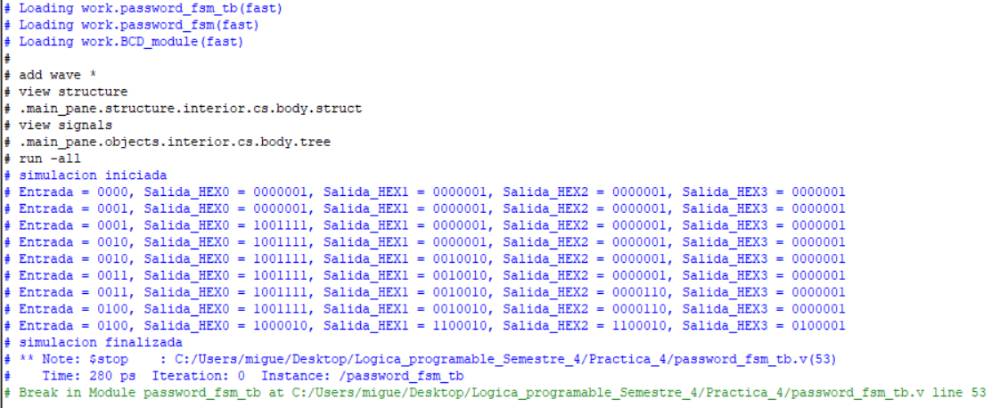
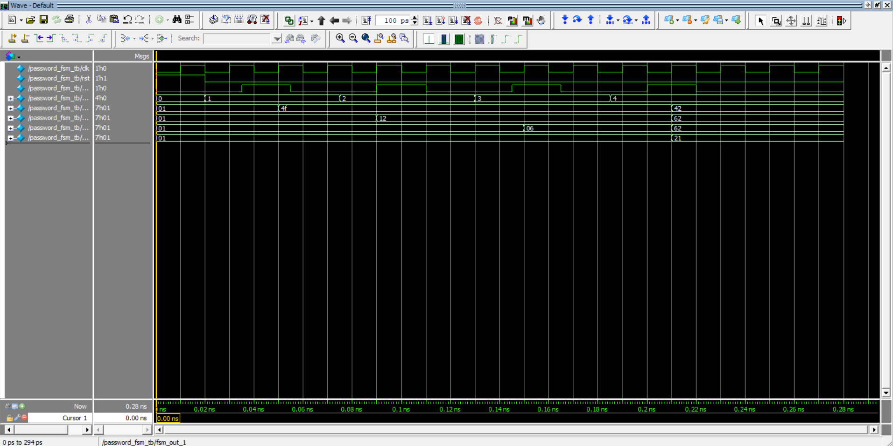

Miguel Alonso De La Rosa Zamora A01646106
# Password
## Objetivo
  - Implementar un sistema Verilog que lea el valor de 4 switches de la FPGA, interprete su valor como un número binario y compare si coincide con la contraseña predeterminada. El resultado se mostrará en displays con la palabra "Good" si la contraseña es correcta o "Bad" si no lo es.

## Materiales Necesarios:
  - Tarjeta FPGA DE10-Lite
  - Cable USB Blaster para la programación.
  - Software Intel Quartus Prime Lite
  - Código en Verilog
## Descripción del Funcionamiento:
  - Los 4 switches de la FPGA representan un número en binario.
  - 2 botones de la FPGA para 'reset' y para 'next' (Valor booleano que indica cuando escribir un digito). 
  - El valor ingresado representa un digito de la contraseña y compara para saber si coincide con la contraseña.
  - El display presenta el digito ingresado.
  - El displays presenta "Good" o "Bad" si la contraseña es correcta o incorrecta respectivamente.
## Desarrollo de la Práctica:
1. Definir las entradas y salidas:
   - Entradas: 4 switches (SW[3:0]), 2 key (KEY[1:0])
   - Reloj: MAX10_CLK1_50
   - Salidas: 4 displays [6:0](HEX0, HEX1, HEX2, HEX3)

 Subir al repositorio donde se encuentran los archivos .v de los módulos, su testbench, y las imágenes necesarias para comprobar el óptimo funcionamiento del sistema.
## Descrcipción de los módulos:
El módulo BCD_module recibe una entrada bcd_in de 4 bits que representa un número binario entre 0 y 9, y genera una salida bcd_out de 7 bits correspondiente a la codificación del número en un display de 7 segmentos. La salida se obtiene mediante un bloque case, asignando el patrón adecuado para cada número decimal. La señal de salida se niega debido a que el display del FPGA utiliza lógica activa en bajo.

El módulo BCD_4displays recibe una entrada binaria bcd_in de N_in bits que representa un número decimal completo y genera cuatro salidas (D_un, D_de, D_ce, D_mi) correspondientes a unidades, decenas, centenas y millares, respectivamente. El número de entrada se separa según su valor posicional utilizando operaciones aritméticas, y cada dígito resultante se convierte a su representación en display de 7 segmentos mediante la instanciación del mósulo BCD_module.

El módulo clk_divider recibe como entrada el reloj interno del FPGA de 50 MHz y una señal de reinicio (rst), y genera una señal de reloj de salida (clk_div) con una frecuencia menor definida por el parámetro FREQ. La frecuencia de salida se obtiene mediante un contador que incrementa su valor en cada flanco positivo del reloj de entrada. Cuando el contador alcanza un valor calculado como constantNumber = CLK_FREQ / (2 * FREQ), este se reinicia y la señal de salida conmuta su estado lógico, logrando así la división de la frecuencia del reloj.

El módulo password_fsm verifica si una contraseña ingresada es correcta o incorrecta y muestra el resultado en cuatro displays de 7 segmentos. La verificación se realiza mediante una máquina de estados que compara cada dígito de entrada (fsm_in) con los valores de la contraseña predefinida, avanzando al siguiente estado cuando el valor ingresado coincide. El avance entre estados se controla mediante la señal next, de la cual se genera un pulso para detectar cada nuevo dígito ingresado. Si en cualquier estado el dígito no coincide con el valor esperado, la máquina pasa directamente al estado BAD; si todos los dígitos son correctos, se alcanza el estado GOOD. En el estado GOOD se muestra el mensaje “Good” y en el estado BAD se muestra el mensaje “Bad” en los displays. Mientras se ingresan los dígitos, estos se muestran en los displays utilizando el módulo BCD_module.

## Testbench:
Se desarrolló un testbench para verificar el módulo 'password_fsm', escribiendo la contraseña correcta para observar si los displays si despliegan la palabra 'Good'. 
## Diagrama RTL:
El siguiente diagrama muestra la implementación lógica generada por Quartus a partir del código Verilog del módulo.

## Waveform:
A continuación se observa la simulación temporal del circuito, donde se verifica el comportamiento correcto con la contraseña como entrada. 

## Tarjeta DE10-lite funcionando:
[Link de YouTube para observar el funcionamiento de la práctica 4](https://youtu.be/YVgUJwCelLI) 
