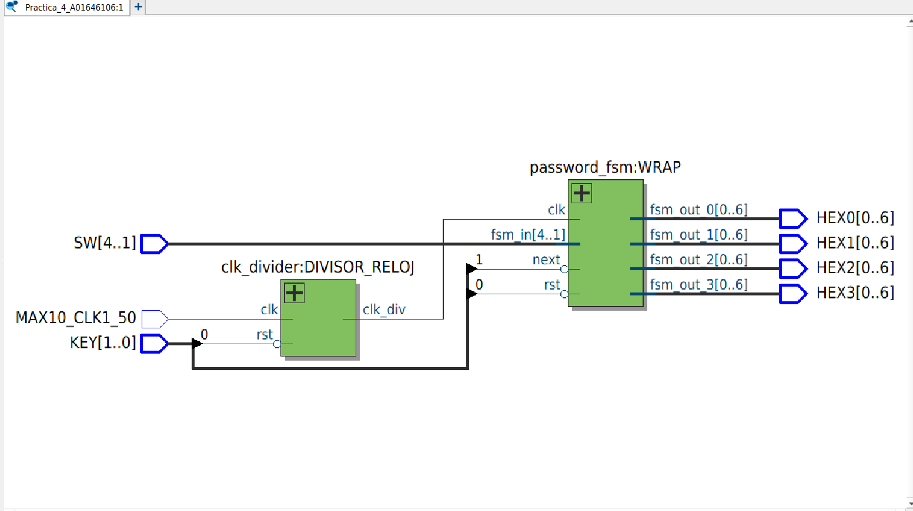

Miguel Alonso De La Rosa Zamora A01646106
# Password
## Objetivo
  - Implementar un sistema Verilog que lea el valor de 4 switches de la FPGA, interprete su valor como un número binario y compare si coincide con la contraseña predeterminada. El resultado se mostrará en displays con la palabra "Good" si la contraseña es correcta o "Bad" si no lo es.

## Materiales Necesarios:
  - Tarjeta FPGA DE10-Lite
  - Cable USB Blaster para la programación.
  - Software Intel Quartus Prime Lite
  - Código en Verilog
## Descripción del Funcionamiento:
  - Los 4 switches de la FPGA representan un número en binario.
  - 2 botones de la FPGA para 'reset' y para 'next' (Valor booleano que indica cuando escribir un digito). 
  - El valor ingresado representa un digito de la contraseña y compara para saber si coincide con la contraseña.
  - El display presenta el digito ingresado.
  - El displays presenta "Good" o "Bad" si la contraseña es correcta o incorrecta respectivamente.
## Desarrollo de la Práctica:
1. Definir las entradas y salidas:
   - Entradas: 4 switches (SW[3:0]), 2 key (KEY[1:0])
   - Reloj: MAX10_CLK1_50
   - Salidas: 4 displays [6:0](HEX0, HEX1, HEX2, HEX3)

 Subir al repositorio donde se encuentran los archivos .v de los módulos, su testbench, y las imágenes necesarias para comprobar el óptimo funcionamiento del sistema.
## Descrcipción de los módulos:

## Testbench:
Se desarrolló un testbench para verificar el módulo 'password_fsm', escribiendo la contraseña correcta para observar si los displays si despliegan la palabra 'Good'. 
## Diagrama RTL:
El siguiente diagrama muestra la implementación lógica generada por Quartus a partir del código Verilog del módulo.

## 
