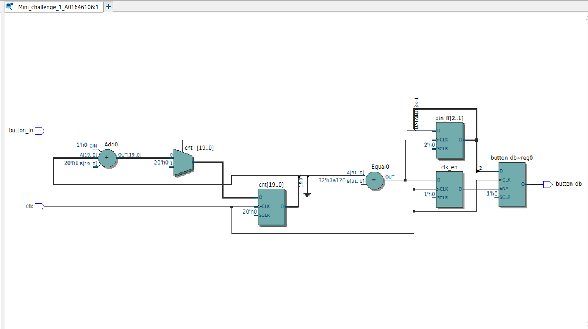
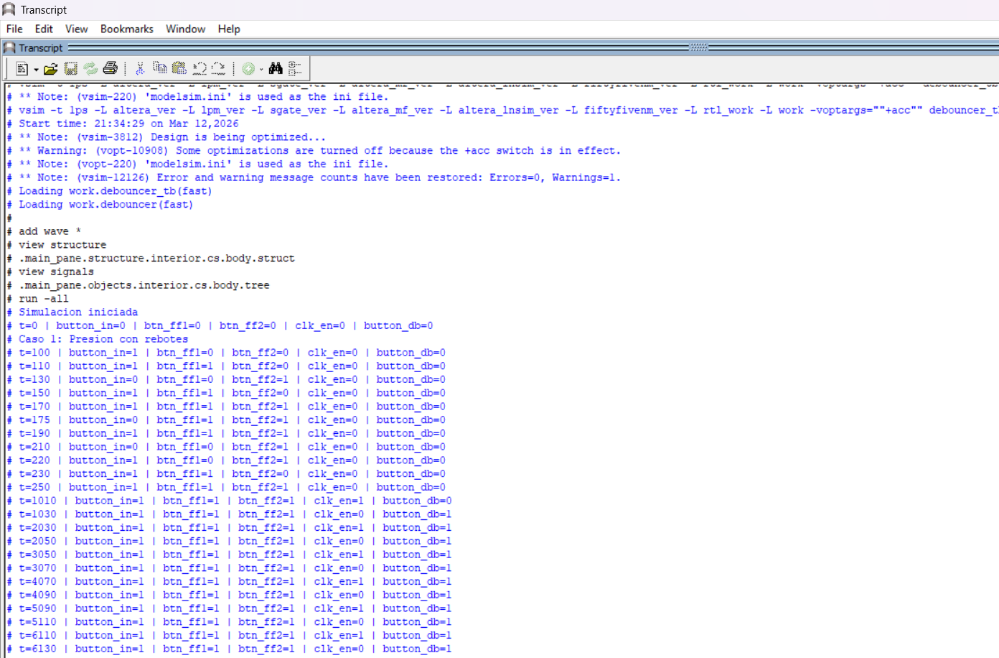
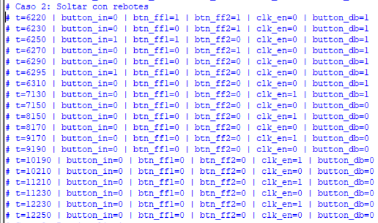
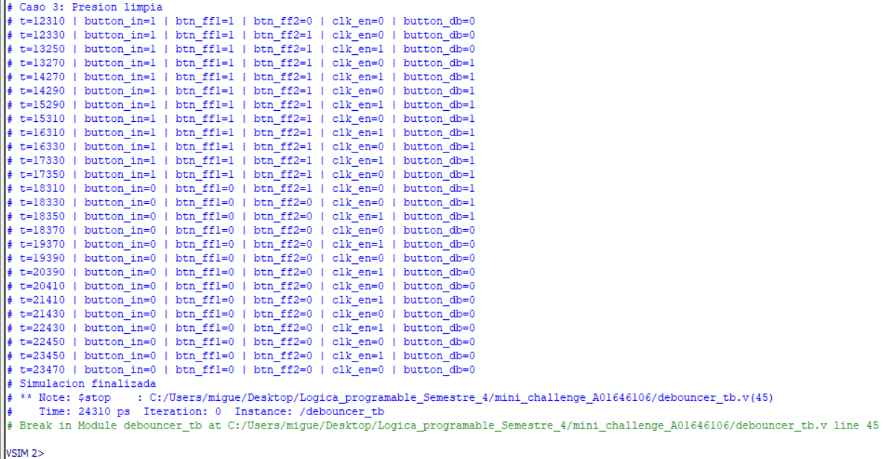
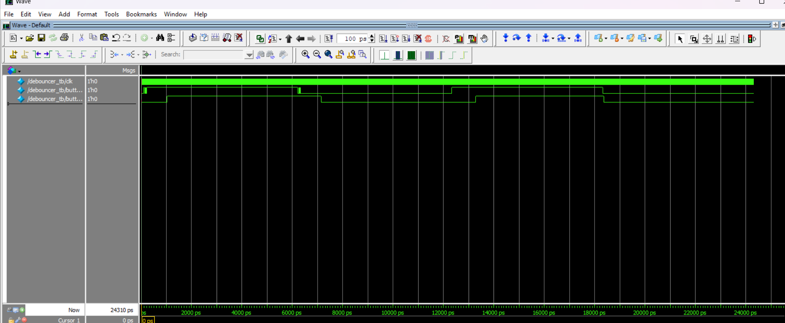

Miguel Alonso De La Rosa Zamora A01646106
# Mini Challenge - Debouncer
## Objetivo:
  - Implementar un módulo debouncer en Verilog que elimine el efecto de rebote mecánico de un botón de la FPGA, mostrando el resultado estabilizado en un LED.

## Materiales Necesarios:
  - Tarjeta FPGA DE10-Lite.
  - Cable USB Blaster para la programación.
  - Software Intel Quartus Prime Lite.
  - Código en Verilog.

## Descripción del Funcionamiento:
  - La señal del botón KEY[0] se invierte y se pasa al módulo debouncer para normalizar la lógica activa en bajo del botón.
  - El módulo elimina los rebotes mecánicos de la señal de entrada mediante un doble flip-flop de sincronización y un muestreo periódico controlado por un contador.
  - El estado estabilizado del botón se refleja en el LED LEDR[0].

## Desarrollo de la Práctica:
1. Definir las entradas y salidas:
      - Entradas: MAX10_CLK1_50, KEY[0:0]
      - Salidas: LEDR[0:0]

Subir al repositorio los archivos .v de los módulos, su testbench y las imágenes necesarias para comprobar el óptimo funcionamiento del sistema.

## Descripción de los módulos:
El módulo debouncer recibe una señal de reloj (clk) y la señal cruda del botón (button_in), y genera una salida estabilizada (button_db) libre de rebotes. El parámetro CMAX define el período de muestreo; con el reloj de 50 MHz y su valor por defecto de 500,000, el botón se muestrea cada 10 ms, tiempo suficiente para que los rebotes mecánicos se extingan. Internamente, la señal de entrada pasa por dos flip-flops en cascada (btn_ff1 y btn_ff2) que la sincronizan con el dominio del reloj y eliminan posibles metaestabilidades. Un contador genera una señal de habilitación (clk_en) que se activa cada vez que alcanza CMAX, momento en el cual el valor estabilizado de btn_ff2 se transfiere a la salida button_db.

El módulo top conecta las entradas y salidas físicas de la tarjeta DE10-Lite con el módulo debouncer. La señal del botón KEY[0] se invierte antes de ingresar al debouncer para compensar la lógica activa en bajo del hardware, y la salida estabilizada se asigna directamente al LED LEDR[0].

## Testbench:
Se desarrolló un testbench para verificar el módulo debouncer.v mediante tres casos de prueba. El primero simula una presión con rebotes, alternando rápidamente la señal de entrada antes de estabilizarse en alto, para comprobar que la salida no reacciona hasta que la señal se mantiene estable. El segundo caso replica el mismo comportamiento al soltar el botón. El tercero simula una presión limpia sin rebotes como caso de referencia. En todos los casos se monitorean las señales internas btn_ff1, btn_ff2 y clk_en para verificar el correcto funcionamiento de la cadena de sincronización y el muestreo periódico. Para la simulación se utilizó CMAX=50 en lugar del valor de síntesis para reducir el tiempo de simulación.

## Diagrama RTL:
El siguiente diagrama muestra la implementación lógica generada por Quartus a partir del código Verilog del módulo.

## Waveform:
A continuación se observa la simulación temporal del circuito, donde se verifica que la salida button_db permanece estable ante los rebotes de la señal de entrada.

